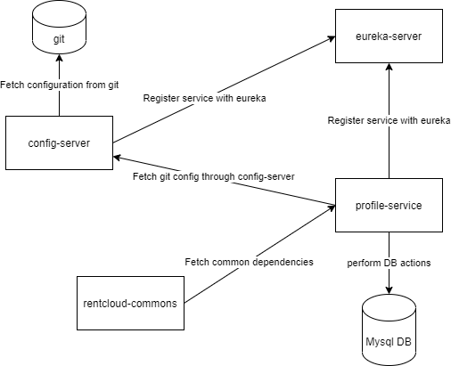
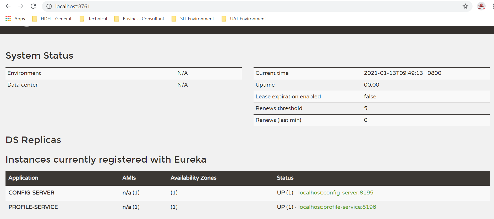
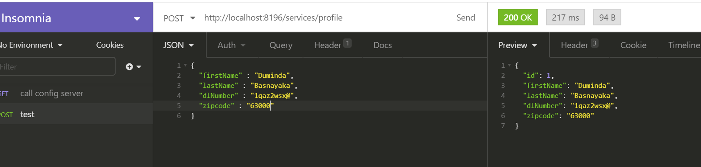

* Diagram for the overall application architechture

* Steps to run the APP

    1. Run the eureka server > this will be running on port 8761 (http://localhost:8761)
    
    2. Run config server > this will be running on port 8195 (http://localhost:8195)
    
    3. Run profile-service > this will be running on port 8196 (http://localhost:8196)

    4. Perform any CRUD operation which has been implemented in profile-service.

 

Note : I have expose my git configuration for this to public so you also can use my git repo to fetch configurations.(https://github.com/DumindaManjula/profileservice-config)

You will have to create your own local database in order to perform this crud operations.

I have provided the PostgreSQL connection configuration as well if want to use your DB as PostgreSQL .So you can uncomment it and go ahead with that configuration.
